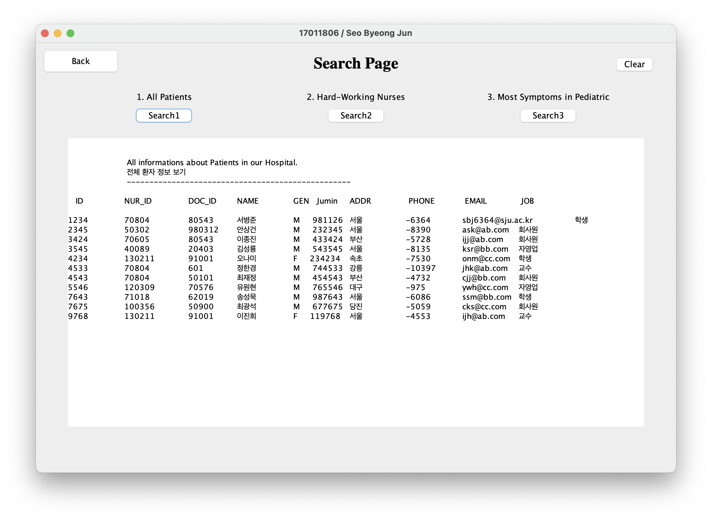

# Hospital Management System
> Program for management of a hospital

### Outline | 개요

데이터베이스 스키마는 주교재 p. 554~562에서 설명된 병원 업무 관리 프로젝트에 대한 5 개 테이블의 정의를 그대로 사용하여 구현한다.

- Doctors/Treatments/Patients/Nurses 테이블 을 교재에서 제시된 데이터를 그대로 사용

  > 단, Charts 테이블은 15개의 튜플을 각자 임의로 만들어서 삽입하되, 테이블 생성시의 제약조건들을 만족해야 한다.

- 프로그램을 구동하면 최초의 사용자 화면 윈도우의 Title 영역에 학번/본인 이름이 표시되도 록 한다. 

- 모든 창에는 확인/취소 버튼이 있어야 하며, 확인은 현재 창의 입력 내용을 해당 창의 기능 에 따라서 수행하는 것을 의미하며, 취소 버튼은 현재 창의 입력을 무시하고 그전 창으로  돌아가거나, 현재 창을 종료하는 형태로 구현한다.

#### [Details | 세부 설계](./details.md)

> 본 내용에 대한 세부적인 설계 사항이다.

### Development Tools | 개발 언어 및 개발 도구

- **DBMS** : MySQL 8.0.15 or later
- **Language** : JAVA (Oracle JAVA SE 11 이상)
- **Tool** : Eclipse

 

### Environment | 개발 환경

- 사용자 인터페이스는 반드시 GUI (Graphical User Interface)를 사용한다. 단, GUI 구동에 필요한 라이브러리는 기본 JDK에 포함되어 있는 것으로 한정한다. (별도의 설치가 필요한 GUI package는 인정되지 않고 0점 처리됨)
- 개발도구는 반드시 Eclipse를 사용한다. (이외의 다른 개발도구로 만들어진 소스코드는 채점하지 않고 0점 처리됨)

 

### Requirements Statement & Schema Definition | 요구사항 명세서 및 스키마 정의서

> [Details](./details.md)

- 요구사항 명세서에는 데이터베이스 설계에 필요한 사용자 요구사항을 항목별로 정리한다. (사용자 인터페이스 및 구현될 삽입/삭제/변경/검색 기능과 관련된 요구사항도 모두 정리할 것)
- 스키마 정의는 MySQL의 EER Diagram 도구를 활용해서 작성한다.

 

### Requirements | 개발 요구사항

> 모든 내용은 하나의 창 안에서 작동해야 한다.

- 초기화 창 : 5개의 테이블에 대한 데이터를 본인이 추가한 데이터를 포함해서 스키마 초기 상태로 되돌린다.

- 삽입 창 : 5개의 테이블을 중에서 1개를 선택한 후에, 해당 테이블에 대한 새로운 데이터는 키보드에서 입력받도록 UI를 구성한다. 단, 제약조건을 벗어난 입력값에 대해서는 적절한 오류 메시지를 표시한다.

  > 주의! : “입력” 기능의 경우 반드시 하나의 윈도우 안에서 모든 데이터를 기입하고 “확 인”버튼 클릭 한번으로 입력되도록 구현함.

- 삭제 창 : 5개의 테이블을 중에서 1개룰 선택한 후에, WEHRE 절에 대한 “조건식”을 입 력받아서 해당 되는 튜플을 삭제한다. 조건식은 “속성 관계연산자 값”의 형태로 구성된 식을 의미한다. 단, 제약조건을 벗어난 입력값에 대해서는 적절한 오류 메시지를 표시한다.

- 변경 창 : 5개의 테이블을 중에서 1개룰 선택한 후에, SET/WHERE 절에 대한 “조건식”을 각각 입력받아서 해당 되는 튜플을 변경한다. 단, 제약조건을 벗어난 입력값에 대해서는 적 절한 오류 메시지를 표시한다.

- 검색1 창 : 5개의 테이블을 중에서 1개룰 선택한 후에, 해당 테이블에 대한“select * from ” 쿼리를 실행한 결과를 표시한다.

- 검색2 창 : 2개 이상의 테이블이 관련된 중첩질의와 GROUP BY를 모두 포함한 질의문울 표시하고 해당 질의에 대한 검색 결과를 표시한다.

- 검색3 창 : 3개 이상의 테이블이 관련된 중첩질의와 GROUP BY를 모두 포함한 질의문울 표시하고 해당 질의에 대한 검색 결과를 표시한다. 

  

  > 위의 검색2/3 기능에 대한 질의문은 해당 요구사항을 만족하는 “임의의” 질의를 본인이 만 들어서 구현해야 함

 

### Last Update

2021.08.04.

### To do

1. font 바꾸기
2. IDU에 select 화면 추가

 

### Scoring

| 항목                  | 배점 | 점수 | 비고                                                   |
| --------------------- | ---- | ---- | ------------------------------------------------------ |
| Title 표시(학번/이름) | 2    | 2    | 17011806 / 서병준                                      |
| 초기화                | 13   | 13   | 전체 테이블 초기화                                     |
| 삽입                  | 15   | 15   | 새로운 환자 정보 입력                                  |
| 삭제                  | 15   | 15   | 진료 날짜 지난 차트 삭제                               |
| 변경                  | 15   | 15   | 승진한 의사 직급 변경                                  |
| 검색1                 | 10   | 10   | 전체 환자 테이블 보기                                  |
| 검색2                 | 15   | 15   | 차트가 2개 이상인 의사만 보기                          |
| 검색3                 | 15   | 15   | 소아과 의사에게 진료받은 환자 수 증상에 따라 분류 |
| 기타 감점             |      |      |                                                        |
| 총점                  | 100  | 100  |                                                        |

#### Main Page

#### Reset

#### Insert

#### Delete

#### Update

#### Search 1

#### Search 2

#### Search 3

### Conclusion
본 기말고사 프로젝트는 만점이며, 결국 최종 성적 A+를 받을 수 있었다. 이번 학기 총 3차례의 대형 프로젝트를 하며 느낀 것은 교수님께서 단순히 sql과 스키마를 어떻게 설계하는지 가르쳐 주시기보다, 설계한 데이터베이스를 실제로 어떻게 적용시키고 사용하는지를 가르쳐 주고 싶었던 것 같다. 실제로 java를 활용해 GUI를 만들어 데이터베이스를 연동한 것처럼, 추후 Web programming이나 php를 사용할 때도 같은 맥락으로 잘 적용해나갈 수 있을 것이라 생각한다.
