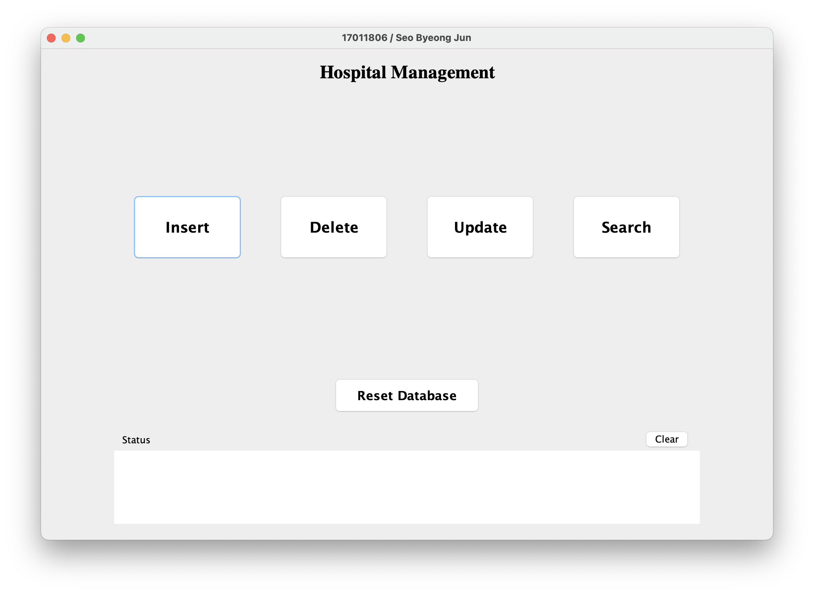
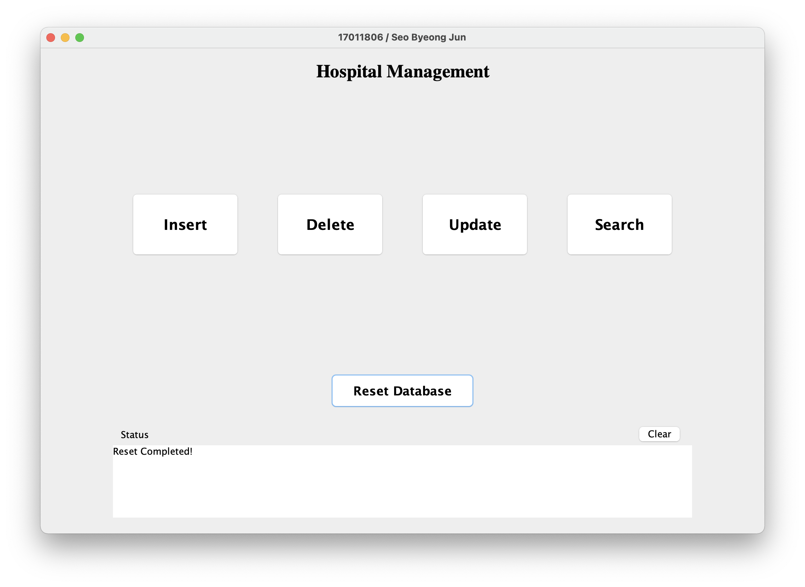
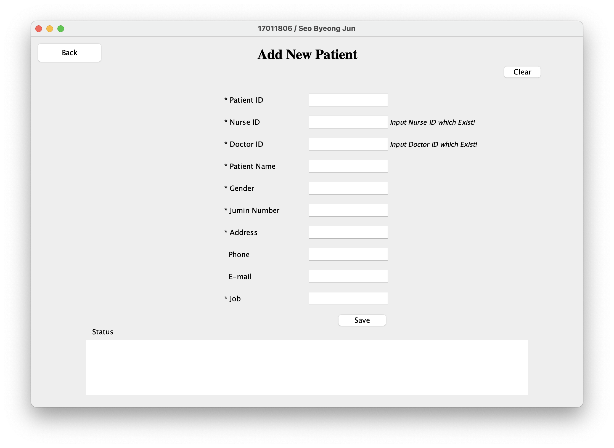
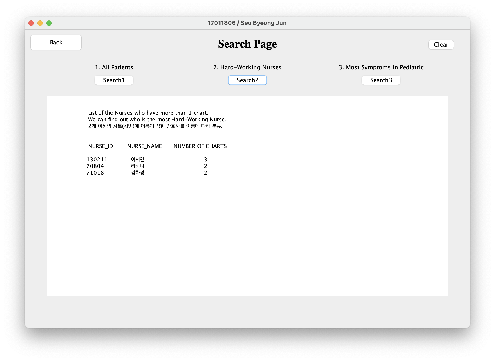

# Details
> Program for management of a hospital

### EER Diagram

 

### Requirements | 개발 요구사항

> 모든 내용은 하나의 창 안에서 작동해야 한다.

####  Main Page

- `초기화` : 5개의 테이블에 대한 데이터를 스키마 초기 상태로 되돌린다.
  

- `삽입`  : 환자 정보를 Patients table에 추가하는 역할을 한다.
   
  
- `삭제` : 날짜를 입력하면 해당 날짜 이전의 모든 Chart를 삭제하는 역할을 한다. 제약조건을 벗어난 입력값에 대해서는 적절한 오류 메시지를 표시한다.
   

- `변경` : 의사 승진 시 데이터베이스 상의 직급을 변경하는 역할을 한다. 제약조건을 벗어난 입력값에 대해서는 적절한 오류 메시지를 표시한다.
  

- `검색1` : 병원 관리 database 내의 모든 환자 정보를 표시한다.
  

- `검색2` : 2개 이상의 Charts(처방)에 이름이 적힌 간호사의 이름에 따라 Chart 수를 표시한다.
  

- `검색3` : 소아과 의사에게 진료를 받은 환자들의 수를 각 진료 내용에 따라 표시한다.

  

 

 

### Scoring

| 항목                  | 배점 | 점수 | 비고                                                         |
| --------------------- | ---- | ---- | ------------------------------------------------------------ |
| Title 표시(학번/이름) | 2    | 2    | 17011806 / 서병준                                            |
| 초기화                | 13   | 13   | 전체 테이블 초기화                                           |
| 삽입                  | 15   | 15   | 새로운 환자 정보 입력                                        |
| 삭제                  | 15   | 15   | 진료 날짜 지난 차트 삭제                                     |
| 변경                  | 15   | 15   | 승진한 의사 직급 변경                                        |
| 검색1                 | 10   | 10   | 전체 환자 테이블 보기                                        |
| 검색2                 | 15   | 15   | 차트가 2개 이상인 의사만 보기                                |
| 검색3                 | 15   | 15   | 소아과 의사에게 진료받은 환자 수 진료 내용(증상) 에 따라 분류 |
| 기타 감점             |      |      |                                                              |
| 총점                  | 100  | 100  |                                                              |

